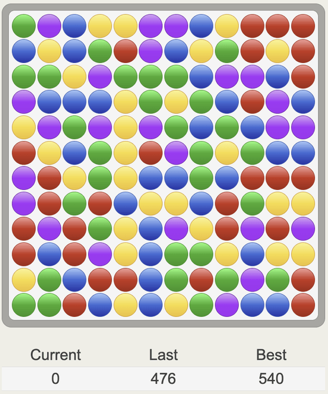

# Jawbreaker

Rewrote Javascript with modern javascript circa 2024. 
No external dependencies required, first or third party. 
No images used, just CSS. Single file.

## Run Server

To run the server, [Go SDK](https://go.dev/) is required.  Once 
installed, just clone this repo and run the following command:

    $ go run .

The server will start and serve on [http://localhost:5454/](http://localhost:5454/).

Two more editions exist.

1. [Jawbreaker 2005](https://github.com/sspencer/jawbreaker-2005) javascript/html, my original version
2. [Jawbreaker 2025](https://github.com/sspencer/jawbreaker) Go/Datastar, my latest version

